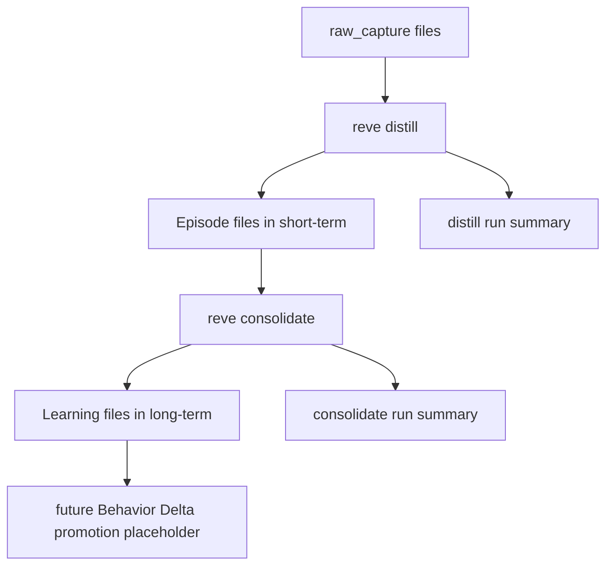

# Reve MVP2 Offline Distillation Design

## Goal

在 `projects/reve` 中先跑通手动触发的离线蒸馏闭环：

`raw_capture -> Episode -> Learning`

第一阶段只验证形成链路与蒸馏质量，不引入后台实时触发、长期注入或 `Behavior Delta` 审阅链。

## Scope

### In Scope

- 手动触发的离线批处理命令
- `raw_capture -> Episode` 蒸馏
- `Episode -> Learning` 聚合
- run record、幂等、锁、失败回滚
- 面向真实 provider 的蒸馏效果验证

### Out of Scope

- hooks 自动触发 `consolidate`
- 后台 worker / forked agent
- `Behavior Delta` 真实生成
- `skill_pack update`
- 长期记忆检索与执行时注入
- 复杂主题聚类或向量召回

## Decision Record

### 为什么先做纯离线批处理

当前最需要验证的是“记忆形成质量”，不是“实时性”。

如果第一阶段同时追求后台触发与长期注入，会把问题混成三类：

- 触发与调度问题
- 蒸馏与聚合质量问题
- 检索与执行影响问题

MVP2 第一阶段先收敛为纯离线批处理，可以把评估目标缩小为：

- `Episode` 是否足够可复用
- `Learning` 是否真正由多个 `Episode` 稳定提炼而来
- 整条驱动链是否具备幂等、回滚、可重复测试能力

### 为什么长期对象先限定为 `Learning`

按契约文档，`Behavior Delta` 是审阅态、可执行行为增量，形成门槛高于 `Learning`。

第一阶段如果直接生成 `Behavior Delta`，会被迫引入：

- `review_state`
- 注入门控
- 行为改变后的效果验证

这会显著扩大边界，因此第一阶段长期对象明确限定为 `Learning`。

## Architecture

### Runtime Shape

`reve` 在第一阶段是一个手动执行的短生命周期本地进程。

推荐使用三条命令：

- `bin/reve distill`
  - 从 `raw_capture` 生成 `Episode`
- `bin/reve consolidate`
  - 从 `Episode` 生成 `Learning`
- `bin/reve drive`
  - 依次执行 `distill` 与 `consolidate`

这样拆分的原因是：

- 日常调试时可以单独检查 `Episode` 质量
- 聚合问题与短期蒸馏问题可分开定位
- 最终完整回归仍可通过单命令 `drive` 触发

### High-Level Flow



## Storage Layout

第一阶段沿用现有 agent 目录结构，只增加长期落点与驱动器辅助状态。

```text
agents/<agent_id>/
  memory/
    raw-capture/
    short-term/
    long-term/
  runs/
  runtime/
    locks/
```

目录职责：

- `raw-capture/`
  - hooks 或 CLI 写入的原始采集对象
- `short-term/`
  - `Episode` 对象
- `long-term/`
  - `Learning` 对象
- `runs/`
  - `distill`、`consolidate`、`drive` 的执行摘要
- `runtime/locks/`
  - 手动重复触发保护，不承载业务对象

## Object Boundaries

### `raw_capture`

保持现状，不新增长期字段，不把 hooks 直接输出视为 short-term。

### `Episode`

第一阶段继续把 `short-term` 目录视为 `Episode` 存储层。

`Episode` 的最小要求：

- 保留来源 `raw_capture` 引用
- 保留模型过滤元数据
- 保留可回放的 `evidence_refs`
- 明确质量状态

### `Learning`

第一阶段 `Learning` 是跨多个 `Episode` 聚合而成的长期对象。

建议最小字段：

- `schema_version`
- `message_id`
- `identity_id`
- `object_kind = learning`
- `object_ref`
- `source_episode_ids`
- `summary`
- `applicability`
- `failure_conditions`
- `evidence_refs`
- `confidence`
- `quality`
- `observed_at`
- `consolidation_run_id`

字段意图：

- `source_episode_ids`
  - 维持可追溯与幂等基础
- `applicability`
  - 为未来长期检索与 Delta 晋升准备
- `failure_conditions`
  - 防止把经验写成无条件真理
- `evidence_refs`
  - 保留来自 `Episode` 的证据链，而不是只保留口头总结

## Command Design

### `bin/reve distill --agent-id <id> [--limit N]`

职责：

- 扫描尚未产出 `Episode` 的 `raw_capture`
- 对每条候选调用推理模型
- 仅把通过过滤的对象写入 `short-term`
- 写入本轮 run summary

第一阶段不改变现有 `distill` 的核心职责。

### `bin/reve consolidate --agent-id <id> [--limit N] [--batch-size N]`

职责：

- 扫描尚未进入 `Learning` 聚合的 `Episode`
- 按固定窗口组批
- 调用推理模型决定本批是否产生 `Learning`
- 写入 `long-term`
- 写入本轮 run summary

第一阶段允许模型输出“本批次不生成 Learning”。

### `bin/reve drive --agent-id <id> ...`

职责：

- 顺序执行 `distill`
- 若存在可聚合 `Episode`，再执行 `consolidate`
- 输出统一摘要

`drive` 是编排入口，不额外承载业务规则。

## Batch Strategy

### Distill Batch

`distill` 仍以单条 `raw_capture` 为单位处理。

理由：

- 便于定位哪条原始采集导致低质量 `Episode`
- 保持与当前实现连续

### Consolidate Batch

第一阶段不做主题聚类，先按时间顺序选取固定窗口批次。

建议默认：

- `batch_size = 5`
- 只处理尚未被成功纳入 `Learning` 的 `Episode`

固定窗口优先于复杂聚类的原因：

- 当前目标是验证长期对象质量，不是寻找最优聚类算法
- 真实数据量仍小，先用简单规则更容易观察问题
- 若模型质量不足，先调 prompt 与字段设计，比先上聚类更有效

后续如质量不足，再增量引入：

- 主题分桶
- session 分桶
- 时间窗 + 主题混合策略

## Distillation and Consolidation Semantics

### `raw_capture -> Episode`

判断重点：

- 是否存在明确、可回放、对未来任务有价值的短期证据
- 是否能归纳为单条稳定的案例摘要
- 是否应直接拒绝而不是制造噪音

### `Episode -> Learning`

判断重点：

- 是否至少由多个 `Episode` 支撑
- 是否能提炼出稳定经验，而不是重复案例描述
- 是否能给出清晰 `applicability`
- 是否能给出明确 `failure_conditions`
- 证据链是否足够让未来晋升到 `Behavior Delta`

失败时允许三种结果：

- `no_learning`
  - 批次内没有稳定经验
- `needs_more_evidence`
  - 有趋势，但证据不足
- `learning_created`
  - 成功形成长期对象

## Idempotency, Locking, and Rollback

### Idempotency

`Episode` 幂等：

- 继续使用 `source_message_id`

`Learning` 幂等：

- 对 `source_episode_ids` 进行稳定排序
- 生成固定 fingerprint
- 若已存在相同 fingerprint 的 `Learning`，则跳过重复写入

### Locking

第一阶段每个 agent 增加简单文件锁：

- `runtime/locks/distill.lock`
- `runtime/locks/consolidate.lock`

目标只是防止用户短时间重复手动触发同一命令，并不承担完整调度语义。

### Rollback

第一阶段采用“成功后提交”策略：

- 推理成功前不写目标对象
- 目标对象写入成功前不写处理完成标记
- run 失败时只留下 run summary，记录失败原因和处理进度

这样可以避免半完成状态污染后续批次。

## Observability

第一阶段不做 UI，但必须保留可审查的执行记录。

每类命令至少输出：

- 扫描数量
- 成功写入数量
- 跳过数量
- 失败数量
- run id
- provider / model

`consolidate` 额外记录：

- 批次数
- 每批输入 `Episode` 数
- 每批产出 `Learning` 数
- `no_learning` / `needs_more_evidence` 统计

## Quality Bar

第一阶段的验收重点不是“产出越多越好”，而是“产出是否未来可用”。

### `Episode` 质量要求

- 不是对原文的机械缩写
- 有明确 `evidence_refs`
- 质量状态可解释
- 可区分支持性、冲突性、证据不足

### `Learning` 质量要求

- 不是单个 `Episode` 的改写
- 至少体现跨案例稳定性
- 包含 `applicability`
- 包含 `failure_conditions`
- 证据链可追溯到 `Episode`
- 允许空产出，不为追求覆盖率强造经验

## AI Runtime and Provider Contract

第一阶段继续复用现有 provider 联动机制：

- 默认从 `~/.codex/config.toml` 读取 provider / model
- 环境变量可覆盖
- `.env.agent-memory` 由 launcher 自动加载

设计要求：

- `distill` 与 `consolidate` 使用同一 provider 解析逻辑
- 支持真实推理模型，不使用 mock 作为主要验证手段
- provider 返回空输出时，必须以显式错误或 skip reason 记录，而不是静默吞掉

## Testing Strategy

### Manual Validation

手动验证顺序：

1. 写入一批真实 `raw_capture`
2. 运行 `bin/reve distill`
3. 人工检查 `Episode`
4. 运行 `bin/reve consolidate`
5. 人工检查 `Learning`
6. 运行 `bin/reve drive` 做整链回归

### Automated Validation

自动化验证先覆盖：

- 命令参数与目录约束
- 幂等
- 批次选择
- 锁冲突
- run summary
- 对模型返回结构的解析

自动化测试不负责证明“模型内容质量”，真实 provider 手测负责该部分。

## Evolution Path

第一阶段完成后，再进入第二阶段增强：

1. 从手动触发演进到后台 worker 触发
2. 再把 `Learning` 的提取与注入链路接上
3. 最后再讨论 `Behavior Delta`

换言之，后续演进顺序应为：

`offline batch -> background execution -> retrieval/injection -> behavior delta`

## Open Questions

- `Learning` 默认是否要求至少 2 条 `Episode` 才允许生成
- `needs_more_evidence` 是否需要显式落盘为中间对象，还是仅记录在 run summary
- 第一阶段 `long-term/` 是否直接平铺存储，还是预留分层子目录

当前设计先不冻结以上三点，只要求实现时保留增量演进空间。
