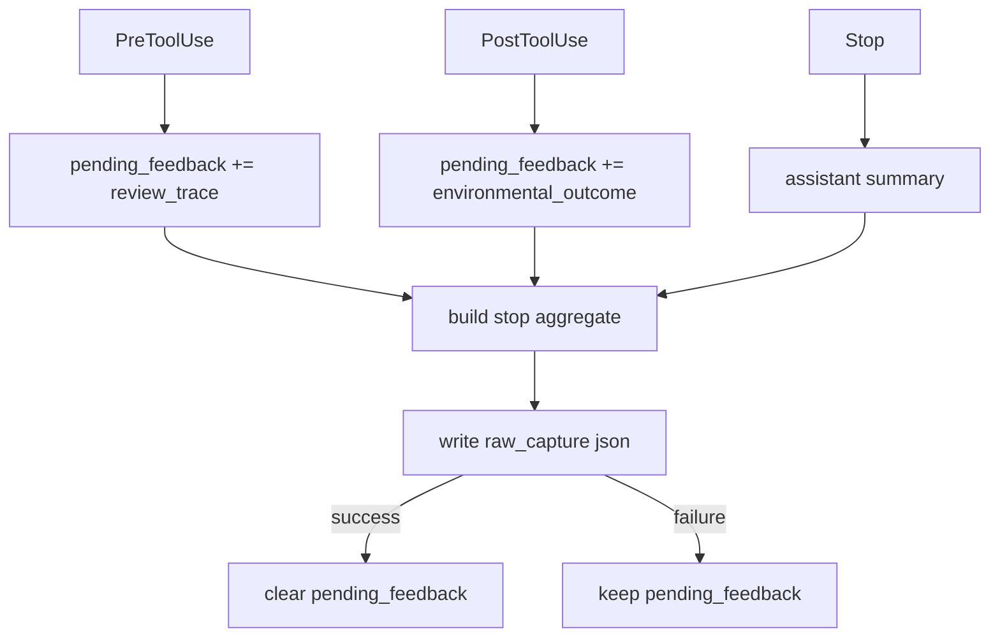

# Hooks Direct Raw Capture Design

- 日期: 2026-04-08
- 范围: `scripts/codex-hooks`, `projects/cli`
- 目标: 让 hooks 在 `Stop` 时直接写入结构化 `raw_capture`，移除对“文本化 hook flush + 外部二次解析”的运行时依赖

## Goal

当前 hooks 已经能采集 assistant summary、Bash command、Bash response 等反馈信号，但这些信号只进入 `pending_feedback`，没有真正落到 `raw_capture`。

本轮设计的目标是：

- 保持 hooks 采集链路稳定、最短
- 在 `Stop` 时把本轮聚合结果直接写成结构化 `raw_capture`
- 保持 `projects/cli run` 作为手工/测试入口可继续使用

## Problem

当前链路存在三个核心问题：

1. hooks 采到了数据，但没有 flush
2. `Stop` 在当前实现中会清空 `pending_feedback`
3. `projects/cli run` 的 hook flush 解析过于依赖严格文本格式，不适合作为 hooks 主路径的稳定落盘机制

因此，本轮不再让 hooks 依赖“生成文本 -> 调用 `agents run` -> 再解析文本”的间接路径。

## Options

### Option A: Stop 聚合直写 raw_capture

- `PreToolUse` / `PostToolUse` 继续只往 `pending_feedback` 累积
- `Stop` 时把 assistant summary + pending feedback 聚合成一条结构化 `raw_capture`
- 写入成功后再清空 `pending_feedback`

优点：

- 与当前 state 设计最一致
- `raw_capture` 主题更完整
- 降低碎片化和重复风险
- 实现范围小，最适合第一轮稳定性修复

缺点：

- 实时性不如逐事件写入
- 若 `Stop` 永远不触发，本轮数据不会落盘

### Option B: 逐事件直写 raw_capture

- 在 `PostToolUse`、`Stop` 等事件分别写独立 `raw_capture`

优点：

- 更实时
- 单次崩溃对数据丢失影响更小

缺点：

- 会产生大量碎片
- 去重、蒸馏与 batching 噪音更高
- 更容易让 `Episode` 混入不完整信号

### Option C: 双写

- 逐事件写 + Stop 聚合写同时保留

优点：

- 数据最全

缺点：

- 当前阶段明显过度设计
- 会放大重复和质量控制难度

## Decision

选择 Option A：`Stop` 聚合直写 `raw_capture`。

理由：

- 最符合当前 `pending_feedback` 的聚合思路
- 可以最小代价闭合采集链路
- 能保证写出的 `raw_capture` 更接近未来短期蒸馏真正需要的“单轮聚合结果”

## Data Model

hooks 直接写出的对象应与 `projects/cli` 当前 `RawCaptureEvent` 兼容：

- `schema_version`
- `message_id`
- `identity_id`
- `object_kind='raw_capture'`
- `object_ref`
- `event_type='captured'`
- `evidence_refs`
- `observed_at`
- `source_kind='hook_flush'`
- `session_id`
- `thread_id`
- `turn_id`
- `event='stop'`
- `workspace_root`
- `assistant_summary`
- `candidates`
- `input`

其中：

- `input` 仍保留可读的 hook flush 文本快照，便于人工排查
- 运行时逻辑不再依赖 `input` 二次解析

## Data Flow

## Writer Semantics

### Write Preconditions

只有满足下列任一条件才写入：

- 存在非空 `assistant_summary`
- `pending_feedback.length > 0`

否则 `Stop` 保持 inert，不产生空壳 `raw_capture`。

### Candidate Mapping

`pending_feedback` -> `candidates` 的最小映射：

- `signal_type` 直接沿用 `FeedbackEntry.signal_type`
- `polarity` 直接沿用 `FeedbackEntry.polarity`
- `summary` 使用 `FeedbackEntry.summary`
- `evidence_refs` 使用 `FeedbackEntry.evidence_refs`

### Assistant Summary

`assistant_summary` 来自 `last_assistant_message` 的压缩文本。

### Evidence Refs

顶层 `evidence_refs` 为聚合去重后的并集，至少包含：

- `turn:<turn_id>`
- `tool-use:<tool_use_id>`（若存在）
- `command:<command>` / `response:<response>`（若存在）

## Failure Handling

- 写入成功后再执行 `state.pending_feedback = []`
- 写入失败时：
  - 不清空 `pending_feedback`
  - 仍持久化 state
  - hook 保持 fail-open，不阻断主流程

## Compatibility

- `projects/cli run` 不移除
- `projects/cli` 的 hook flush 解析仍保留给：
  - 手工测试
  - 构造 fixture
  - 非 hooks 环境下的兼容入口

## Testing

本轮最小测试覆盖：

1. `Stop` 会把 assistant summary + pending feedback 写成结构化 `raw_capture`
2. `PostToolUse` 的 Bash evidence 会进入 `candidates`
3. 没有 summary 且没有 pending feedback 时，`Stop` 不写空壳记录
4. 写入失败时不清空 `pending_feedback`

## Out of Scope

- 逐事件 raw_capture
- hooks 触发实时 `distill`
- `pending_feedback` 数据模型重构
- `raw_capture` 去重策略重构
