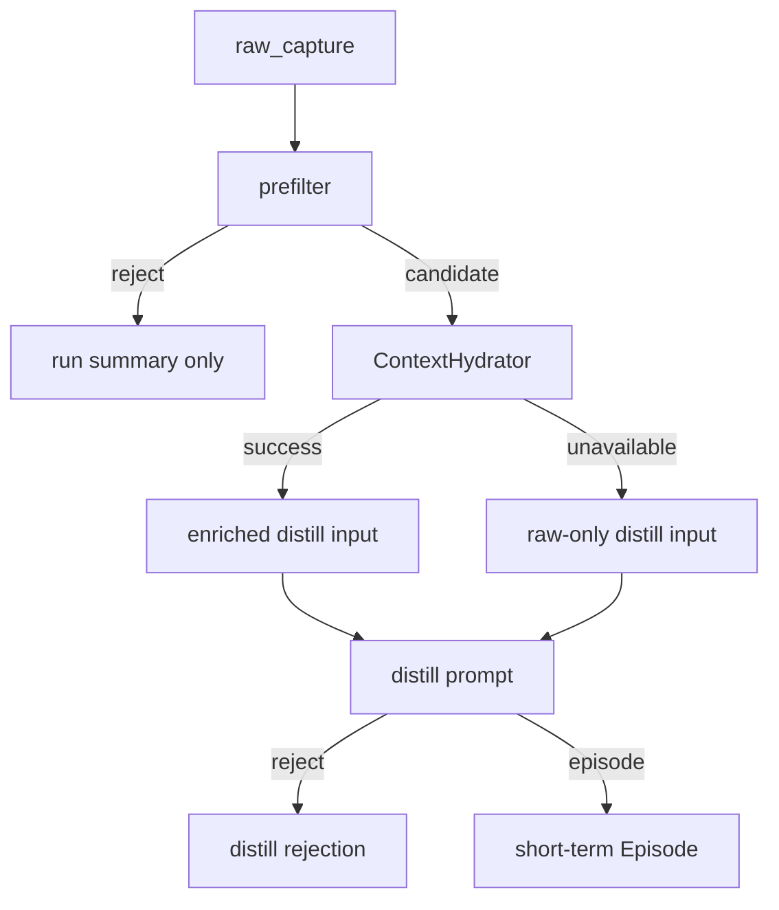
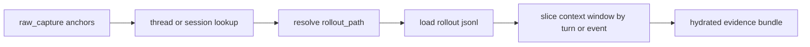

# Reve MVP3 Episode Quality Design

- 日期: 2026-04-08
- 范围: `projects/reve`
- 目标: 在不扩大动态记忆边界的前提下，提升 `raw_capture -> Episode` 阶段的质量与可追溯性

## Goal

MVP3 聚焦解决 MVP2 暴露出的核心质量问题：

- `raw_capture` 直接蒸馏时，容易生成“只有请求、没有结果”的 episode
- episode 容易混入多个候选信号，主题纯度不足
- evidence refs 过薄，后续 `consolidate` 只能得到 `needs_more_evidence` 或宽泛 learning

本阶段不扩大到长期记忆准入，不处理长期注入，也不引入实时后台调度。

## Scope

### In Scope

- `distill` 阶段新增 `raw_capture` 预筛
- 只对存在潜在蒸馏价值的 `raw_capture` 做上下文补全
- 定义后端无关的 `ContextHydrator` 角色
- 以 `Codex rollout` 作为首个 hydration adapter 的验证目标
- 收紧 `distill` prompt，明确“失败是正确结果”
- 补充更细的 run summary / rejection 语义，支持后续人工评估

### Out of Scope

- `Episode -> Learning` 聚合策略重构
- 实时 hooks 触发 distill
- 长期记忆写入、准入、注入
- `Behavior Delta`
- 复杂主题聚类、向量召回
- 多后端正式实现

## MVP2 Findings Driving This Design

MVP2 已经证明链路可用，但质量不足：

- `research-agent` 真实验证能产出 episode，但 consolidate 结果稳定落在 `needs_more_evidence`
- `unity-optimization-agent` 真实验证已证明长期学习可形成，但质量强依赖输入 episode 的主题纯度
- 当前主要瓶颈不在 provider 连通性，而在短期输入质量与证据质量

因此，MVP3 的主问题不是“怎样让更多输入变成 episode”，而是“怎样更可靠地拒绝无价值输入，并为少量高价值候选补足证据上下文”。

## Decision Record

### 为什么不先扩大 `direct_input` 文本

在 capture 阶段直接扩写 `direct_input` 的上下文，主要问题是：

- capture 时无法判断哪些邻域上下文未来最有用
- 用户输入发生时通常还拿不到后续 assistant / tool outcome
- 大量重复上下文会直接固化到 `raw_capture`，增加噪音

所以 MVP3 不把“扩大原始正文”作为主路径。

### 为什么先做 `prefilter + hydration`

当前最缺的不是更多文本，而是更有判别力的上下文：

- 这条输入最终得到了什么结果
- assistant 是否给出了可复用判断
- tool / hook 结果是否提供了可追溯证据

这些信息更适合在 distill 时按会话锚点回填，而不是在 hooks 采集时盲目扩写。

## Architecture

### High-Level Flow

### Runtime Roles

- `raw_capture`
  - 保持“轻量原始采集对象”定位
  - 只补最小锚点字段，不扩大量正文
- `prefilter`
  - 零成本或低成本判断某条 `raw_capture` 是否值得进入蒸馏候选池
- `ContextHydrator`
  - 一个后端无关角色
  - 负责根据锚点回填会话邻域上下文
- `distill`
  - 使用 `raw_capture + hydrated context` 生成 episode 或拒绝生成

## Data Boundary

### `raw_capture` 的调整原则

MVP3 只建议补最小 lookup 键：

- `session_id`
- `thread_id`
- `turn_id`
- `event`
- `workspace_root`
- `rollout_path_hint` 可选

边界：

- 不在 `raw_capture` 中固化整段 transcript
- 不把 hooks 输出直接视为 short-term memory
- 不为了兼容某个后端而提前冻结完整字段模型

### `raw_capture` 新增字段的目的

- `session_id / thread_id`
  - 用于定位会话级上下文源
- `turn_id`
  - 用于切到更接近当前信号的上下文窗口
- `event`
  - 区分采集发生在用户输入、hook flush 或其他阶段
- `workspace_root`
  - 维持运行环境锚点
- `rollout_path_hint`
  - 可选缓存字段，避免每次 hydration 都重新查索引

## Prefilter Design

### Goal

在调用推理模型前，先挡掉明确低质量输入，避免浪费 hydration 与推理成本。

### 预筛输出语义

建议至少区分：

- `reject_low_signal`
- `reject_missing_anchor`
- `candidate_raw_only`
- `candidate_needs_hydration`

### 预筛判断重点

明确应优先拒绝的类型：

- 纯空壳输入
- 明显只包含任务请求、没有任何结果线索的直接输入
- 缺少最小锚点且无法回放的对象
- 明显重复、内容过短且无附加 summary 的对象

允许进入候选池的类型：

- 含有 assistant summary / hook summary 的对象
- 含有工具结果或错误线索的对象
- 含有明确会话锚点、可通过 hydration 补证据的对象

注意：

- prefilter 只做“是否值得进一步处理”的判断
- prefilter 不负责判断是否一定生成 episode

## Context Hydration Design

### Abstraction First

系统层只定义一个抽象角色：`ContextHydrator`。

它的职责不是“读取 Codex 数据库”，而是：

- 接收 `raw_capture` 的最小锚点
- 尝试回填与该信号最相关的会话邻域
- 返回可蒸馏的最小证据片段

建议的逻辑接口语义：

- 输入:
  - `raw_capture anchor fields`
- 输出:
  - `hydration_status`
  - `context_window`
  - `hydrated_evidence_refs`
  - `failure_reason` 可选

当前阶段这只是职责草案，不冻结最终代码接口。

### Codex Adapter As First Implementation

MVP3 的首个 adapter 是 `CodexRolloutHydrator`。

当前已确认的事实是：

- 本机 Codex 的本地 SQLite 更像索引层
- 完整可回放上下文位于 `rollout-*.jsonl`

因此 Codex adapter 的建议路径是：

这里需要明确两点：

- 这是 Codex 首个适配器的实现策略，不是系统总前提
- 若回放失败，应返回 hydration unavailable，而不是中断整个 distill 流程

### Hydration Window Principles

建议只回填最小必要邻域，不追求完整 transcript：

- 当前输入附近的 user message
- 对应 assistant response 摘要
- 与该 turn 相关的 tool / hook outcome
- 必要时附带前后少量 turn 作为 disambiguation

目的不是还原整场会话，而是补齐“这个输入最后产生了什么信号”。

## Distill Prompt Design

### Core Principle

distill prompt 必须明确禁止“为了产出而产出”。

模型需要接受下面的事实：

- 大多数 `raw_capture` 没有足够价值，应该拒绝生成 episode
- 大多数上下文并不闭环，缺少 outcome 或证据时应该失败
- 如果一条输入同时包含多个候选信号，优先拒绝，而不是强行合成宽泛 summary

### Prompt Policy

prompt 中应明确要求：

- 默认保守，而不是默认产出
- 缺上下文时优先拒绝
- 缺可追溯 evidence refs 时优先拒绝
- 无法形成单一主信号时优先拒绝
- 不要把请求意图、礼貌话术、泛化建议包装成短期记忆

### Distill Result Semantics

建议把结果细分为：

- `episode_created_raw_only`
- `episode_created_hydrated`
- `rejected_low_signal`
- `rejected_insufficient_context`
- `rejected_multi_signal`
- `rejected_no_reusable_outcome`

这组语义的目的不是追求分类精度，而是让 operator 能分清：

- 问题来自采集
- 问题来自 hydration
- 问题来自 prompt 收紧

## Episode Quality Target

MVP3 不追求提高 episode 数量，而追求提高可复用率。

一个合格 episode 至少应满足：

- 只表达一个主信号
- 有明确来源 `raw_capture`
- 有可回链的 evidence refs
- 有足够具体的 outcome 或 operational signal
- 能解释为什么它对未来任务可能有价值

如果做不到，拒绝生成是正确行为。

## Run Summary and Evaluation

### Run Summary

`distill` run summary 建议新增统计：

- `prefilter_rejected`
- `hydration_attempted`
- `hydration_succeeded`
- `hydration_unavailable`
- `episodes_created_raw_only`
- `episodes_created_hydrated`
- `rejected_low_signal`
- `rejected_insufficient_context`
- `rejected_multi_signal`

### Operator Evaluation

MVP3 的人工评估重点应转为：

- 有多少 direct input 被正确拒绝，而不是错误进入 short-term
- hydration 后是否明显提升 evidence refs 的具体性
- 是否减少“一个 episode 合并多个候选信号”
- 后续 `consolidate` 的 `needs_more_evidence` 是否下降

## Risks

### 风险 1: 过度耦合 Codex 实现

如果把 `state_5.sqlite`、`rollout_path` 等细节直接写成系统契约，会损害可移植性。

缓解方式：

- 文档只冻结 `ContextHydrator` 职责，不冻结具体后端实现
- 将 Codex rollout 回放明确标记为首个 adapter

### 风险 2: prefilter 过紧导致有价值信号被误拒

缓解方式：

- 先保留 rejection reason 统计
- 以真实样本回看误拒率，而不是先拍脑袋收紧阈值

### 风险 3: hydration 成本过高

缓解方式：

- 只对候选对象做 hydration
- hydration 失败允许降级 raw-only distill

## Assumptions

- 假设: hooks 能较稳定提供 `session_id / thread_id / turn_id` 等锚点
- 假设: 对 direct input 而言，补充 assistant/tool 邻域比扩写原始正文更能提升 episode 质量
- 假设: 当前阶段只做 Codex adapter，足以验证 `ContextHydrator` 这一路径的价值

这些仍需在后续实现与真实样本验证中继续确认。

## Open Questions

- `turn_id` 与 rollout 事件切片的稳定映射规则仍需单独验证
- `rollout_path_hint` 是否值得直接固化在 `raw_capture`
- prefilter 应该更多依赖规则，还是允许一层极轻量推理判断
- hydration window 的最小尺寸如何选择，才能兼顾质量与成本

## Non-Goals For MVP3

- 不扩大到长期记忆的准入与写入策略
- 不处理 `Learning -> Behavior Delta`
- 不做实时异步 distill worker
- 不做复杂主题分桶
- 不承诺多后端正式对齐

## Expected Outcome

若 MVP3 成功，预期应看到：

- short-term episode 总量下降，但有效率上升
- `needs_review` episode 比例下降
- evidence refs 更具体
- `consolidate` 中的 `needs_more_evidence` 占比下降
- 长期 learning 更少出现“跨主题拼接”
