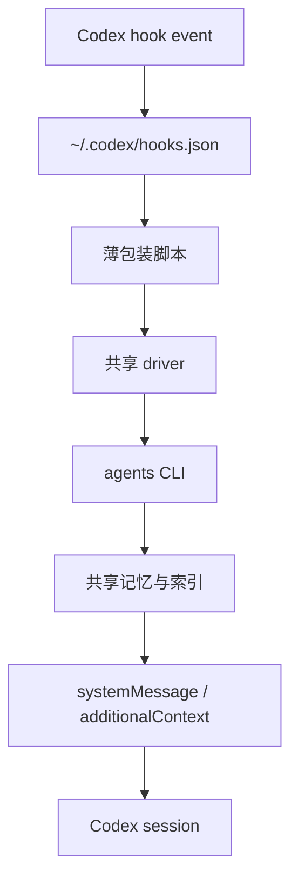

# Codex Hooks 记忆注册设计

> 2026-04-06 更新注记：当前 MVP 运行策略已切到“短期记忆优先”，`Stop` 仅做短期反馈 flush；长期记忆写入与长期准入判断暂不启用。

## 作用

把 Codex hooks 接到 `dynamic_memory` 的读写链路上，让其他 Codex session 在合适的 turn 边界自动提取记忆、回填记忆，并把短期反馈和长期索引分别落到对应流程。

这是一层 glue 设计，不改变 `agent_identity`、`short-term-feedback`、`memory-distillation`、`long-term-memory-index` 的语义边界。

## 设计目标

- 让 hooks 成为跨 session 的自动触发器
- 让记忆读写继续复用现有 `agents` CLI
- 让短期反馈和长期索引走不同的触发路径
- 避免把完整 transcript 塞进上下文或记忆文件
- 让注册方式可在本机其他 Codex session 中复用

## 非目标

- 不在 hooks 层直接定义 `dynamic_memory` 对象内部结构
- 不把 hooks 当作长期记忆本体
- 不让 hooks 直接写入任意文件格式
- 不在这一步解决远程共享后端或 MCP 化

## 约束

来自当前 Codex hooks 文档与本项目当前注册策略的约束：

- `codex_hooks = true` 必须开启
- hooks 可以放在 `~/.codex/hooks.json` 或 `<repo>/.codex/hooks.json`
- 多个匹配 hooks 会同时运行，不能假设“后面的 hook 会覆盖前面的 hook”
- Codex runtime 可用触发点包含 `SessionStart`, `UserPromptSubmit`, `Stop`, `PreToolUse`, `PostToolUse`
- 当前本项目默认注册仅启用 `SessionStart`, `UserPromptSubmit`, `Stop`
- `UserPromptSubmit`、`Stop`（以及可选的 `PreToolUse`、`PostToolUse`）都是 turn scope
- `SessionStart` 支持 `startup|resume` 匹配
- `SessionStart`, `UserPromptSubmit`, `Stop` 可以输出 `systemMessage`
- `SessionStart` 还可以输出 `additionalContext`
- `PreToolUse` 和 `PostToolUse` 当前只针对 `Bash`

结论：

- 记忆主流程应挂在 `SessionStart`、`UserPromptSubmit`、`Stop`
- `PreToolUse`、`PostToolUse` 降级为可选扩展，不作为当前默认注册的一部分

## 对标经验筛选（oh-my-codex）

本节只吸收与本项目目标一致的经验，不做“照搬”。

### 可迁移经验（保留）

- 明确区分 `native` 与 `derived` 事件，并在文档里固定事件 envelope 最小字段
- `derived` 信号默认关闭、显式开关开启，避免推断型信号在早期污染主流程
- 对非关键副作用采用 `best-effort`，失败只记日志不阻断主任务
- 把超时、去重、日志、状态回填集中到共享 driver，避免分散在每个 hook 适配脚本
- 显式定义“副作用只在主会话/已挂载 identity 生效”的边界，避免重复写入

### 不迁移经验（排除）

- 不引入通用 hooks 插件系统（如 `*.mjs` 生态、插件 SDK、插件生命周期命令）
- 不把 hooks 扩展为团队编排或通知总线
- 不将本项目主问题转向 workflow 层能力建设

原因：本项目当前范围是 Agent 专属技能与专属记忆，目标是稳定 `dynamic_memory` 注册链路，不是构建新一层通用 Codex workflow 平台。

## 推荐架构

核心原则：

- `hooks.json` 只负责注册和路由
- 薄包装脚本只负责解析事件和整理输入输出
- 共享 driver 负责通用逻辑、去重、限流、状态回填
- `agents` CLI 负责真实记忆读写

## 注册模型

### 机器级注册

主注册点放在 `~/.codex/hooks.json`，作为这台机器上所有 Codex session 的统一入口。

原因：

- 其他仓库里的 session 也能触发同一套 hooks
- 避免每个仓库重复复制一份逻辑
- 统一控制重复写入、限流和故障策略

### 仓库级模板

仓库内保留一份模板配置，作为安装来源和版本控制对象。

建议路径：

- `docs/portable-agent-contract/dynamic-memory/codex-hooks-memory-registration.md`
- `.codex/hooks.json` 模板
- `.codex/hooks/*.py` 或等价脚本目录模板

### 安装原则

- 只保留一个 active registry
- 不允许 repo-local hooks 和 user-global hooks 以互相独立、重复语义的方式同时生效
- 如果需要双层存在，repo-local 只能作为模板来源，不能再单独注册一套不同逻辑
- 安装脚本应检测 repo-local `.codex/hooks.json` 冲突，并要求显式 `--force` 才继续

## Identity binding

hooks 只决定“何时触发记忆动作”，不负责“这个 session 属于哪个 agent_identity”。

active `agent_id` 必须由会话 bootstrap 提前绑定，然后由 hooks 读取。

建议绑定来源优先级：

1. 显式环境变量
2. repo-local session binding 文件
3. 显式 mount 流程写入的 workspace binding

MVP 补充约束（更新）：

- 初始路径是“严格自动匹配”，不是阻断式强制选择
- 自动匹配证据源采用方案 `3`：`首条用户消息 + workspace/repo 路径 + 预定义 specialization 规则`
- 必须高置信且唯一命中才允许自动挂载；不满足则保持 unmounted
- 找不到严格匹配时，hooks 不阻断用户原始任务，不注入强制选择门禁
- 用户仍可在 session 内显式输入 `数字`、`agent_id` 或 `no identity`（含 `Not applicable Agent Identity / 不适用 Agent Identity`）
- 若用户显式选择 `no identity`，该 session 保持 no-mount，后续 hooks 不再尝试自动挂载
- hooks runtime 不再根据“只剩一个可见 identity”自动绑定

如果没有绑定到有效 `agent_id` 且严格匹配未命中，hooks 继续 inert，不擅自选择任何 identity。

## 事件契约（MVP）

为了避免不同 hook 适配脚本语义漂移，所有事件在进入共享 driver 前先归一为统一 envelope。

建议最小字段：

- `schema_version`（当前固定 `1`）
- `event`（`session-start` / `user-prompt-submit` / `stop` / `pre-tool-use` / `post-tool-use`）
- `source`（`native` 或 `derived`）
- `timestamp`
- `session_id`
- `thread_id`（可空）
- `turn_id`（可空）
- `agent_id`（未挂载时可空）
- `context`（事件特定最小上下文，禁止塞入完整 transcript）

`derived` 事件约束（MVP）：

- 默认关闭（例如 `OBSIDIAN_AGENT_MEMORY_SERVER_HOOK_DERIVED_SIGNALS=0`）
- 仅在显式开启时生成（例如 `needs-input` / `bash-risk-high`）
- 必须带 `confidence` 与 `parser_reason`
- 只作为辅助证据，不能单独触发破坏性动作

## Hook matrix

### `SessionStart`

用途：

- 冷启动或恢复时预热长期记忆
- 注入当前 agent 的最小行为边界
- 恢复 session 级状态文件

脚本：

- `session_start.py`

职责：

- 读取 active `agent_id`
- 读取 session state
- 把原始 hook 负载归一到统一 envelope（`source=native`）
- 若未绑定，则尝试 strict auto-match；命中则自动挂载并说明原因，未命中则 inert
- 若已绑定，则调用 `agents verify --agent-id <id>` 做长期记忆提取
- 生成短的 `additionalContext`
- 写回 session state 的 `last_session_start` / `last_retrieval`
- 提示当前 `Mounted identity`

输出：

- `additionalContext` 优先
- 必要时 `systemMessage`

### `UserPromptSubmit`

用途：

- 每轮输入前做记忆提取
- 识别任务切换、错误恢复、计划冻结、输出前检查等触发条件
- 给当前 turn 注入最小记忆提示

脚本：

- `user_prompt_submit.py`

职责：

- 读取 prompt 和 session state
- 归一 `user_prompt_submit` 事件 envelope
- 若 session 未绑定，先解析显式输入 `数字 / agent_id / no identity / 选择+任务`
- 若无显式选择，再执行 strict auto-match（证据源方案 `3`）
- 选择成功后，调用 `agents verify --agent-id <id>` 完成初始化
- 若 strict auto-match 未命中，保持 inert，不打断当前任务
- 从长期记忆索引生成短提示
- 更新短期反馈队列
- 提示当前 `Mounted identity`

输出：

- `additionalContext` 优先
- 不要输出长证据正文

### `Stop`

用途：

- 结束 turn 时回填短期反馈
- 将本轮稳定结论、分支选择、失败经验收敛到短期事件
- 为下一轮准备压缩后的短期摘要

脚本：

- `stop.py`

职责：

- 归一 `stop` 事件 envelope
- 扫描 pending feedback queue
- 调用 `agents run --agent-id <id>` 仅写入短期事件
- 生成最短的收尾提示
- 清空已提交队列

输出：

- 以 `continue: true` 的纯 side effect 为主
- 真实 Codex session smoke 里，`Stop` 若回传额外 `hookSpecificOutput` 会失败
- 因此当前实现不依赖 `Stop` 返回额外上下文，只保留记忆 flush

### `PreToolUse`（可选扩展，当前默认未注册）

用途：

- 仅在需要 Bash 风险护栏时启用
- 记录即将执行的命令作为短期反馈证据

当前状态：

- 已从默认 hooks registry 移除
- 如未来恢复启用，必须保持“可插拔、不影响主链路”

### `PreToolUse`（扩展实现规范）

用途：

- 只做 Bash 级的证据边界与护栏
- 采集即将执行的命令作为短期反馈的一部分

脚本：

- `pre_tool_use.py`

职责：

- 归一 `pre_tool_use` 事件 envelope
- 记录 `tool_input.command`
- 做最小风险判断
- 必要时阻断明显危险的 Bash 命令
- 若输出提示，必须带上当前 `Mounted identity`

输出：

- `systemMessage`
- 只有高风险命令才考虑 block

### `PostToolUse`（可选扩展）

用途：

- 只做 Bash 结果回填与证据挂接
- 把工具输出归入短期反馈对象

脚本：

- `post_tool_use.py`

职责：

- 归一 `post_tool_use` 事件 envelope
- 记录 `tool_response`
- 提取 `evidence_refs`
- 更新 short-term feedback sidecar
- 生成是否需要长期晋升的候选标记
- 输出极短 identity 提示

输出：

- `systemMessage` 或 `additionalContext`
- 默认不阻断主流程

## 脚本分层

建议不要让每个 hook 脚本直接堆业务逻辑。更稳妥的结构是：

1. `memory-hook-driver.py`
   - 统一解析 Codex hook stdin
   - 统一归一 event envelope（native/derived）
   - 统一读写 session state
   - 统一调用 `agents` CLI
   - 统一处理超时、去重、日志和降级策略
2. `session_start.py`
   - 事件适配器
3. `user_prompt_submit.py`
   - 事件适配器
4. `stop.py`
   - 事件适配器
5. `pre_tool_use.py`
   - 事件适配器
6. `post_tool_use.py`
   - 事件适配器

这样做的目的不是抽象洁癖，而是把重复写入、状态竞争和行为漂移集中在一个点处理。

## 状态模型

hooks 侧需要一个独立的 session state，不要和长期记忆文件混在一起。

state 归宿口径（已定）：

- 采用 machine-level state（跨 agent / 跨 session）
- 默认根路径：`~/.codex/memories/obsidian-agent-memory-server/hooks`
- 可通过 `OBSIDIAN_AGENT_MEMORY_SERVER_HOOKS_STATE_ROOT` 覆盖根目录（并兼容 `XDG_STATE_HOME` 基础目录）

建议最小字段：

- `session_id`
- `agent_id`
- `last_inject_turn`
- `last_retrieval_turn`
- `pending_feedback_ids`
- `pending_long_term_candidates`
- `cooldown_turns`
- `last_flush_at`

状态文件只保存控制信息，不保存完整 transcript。

## 数据流

### 启动

1. Codex 触发 `SessionStart`
2. `session_start.py` 读取 active `agent_id`
3. `agents verify` 拉取最小长期记忆
4. 脚本输出 `additionalContext`
5. Codex 会话进入带约束状态

### 输入前

1. Codex 触发 `UserPromptSubmit`
2. 若 session 未绑定，先把 prompt 解析为 identity 选择协议
3. 若用户完成选择，则调用 `agents verify` 初始化所选 identity
4. 若 prompt 中还包含剩余任务，则把剩余任务作为真实任务继续处理
5. 对已绑定 session，再按原规则判断是否需要刷新记忆

### 工具调用前后

1. （可选）`PreToolUse` 记录即将执行的 Bash 命令
2. （可选）`PostToolUse` 记录 Bash 结果
3. 若启用该扩展，证据写入短期反馈 sidecar
4. 满足晋升条件时生成长期候选

### 停止

1. Codex 触发 `Stop`
2. `stop.py` flush pending queue
3. `agents run` 写回长期记忆
4. 清空已提交状态

## 失败策略

### 必须 fail-open 的情况

- 绑定不到有效 `agent_id`
- `agents` CLI 不可用
- session state 文件损坏但可恢复
- 长期记忆检索超时

这类故障只记录 warning，不阻断 Codex 主任务。

补充约束（来自对标经验筛选）：

- 非关键副作用（例如候选标记、辅助摘要）超时后直接降级，不重试阻断主流程
- 高成本逻辑（例如长文本压缩、候选批处理）应在 driver 内做可中断执行并设定超时预算
- 同一 `session_id + turn_id + event` 的重复失败要做抑制，避免 warning 风暴
- 最小策略可采用“首个失败对外可见，后续同键失败静默降级”
- `agents` CLI 调用超时预算应可配置（例如 `OBSIDIAN_AGENT_MEMORY_SERVER_HOOKS_AGENTS_TIMEOUT_MS`）

### 可以 fail-closed 的情况

- （可选扩展启用时）`PreToolUse` 识别到明显危险的 Bash 命令

原因：

- 这是护栏，不是记忆系统本体
- 其他 hook 失败不应把会话卡死

### 去重策略

因为当前 Codex 可能同时运行多个匹配 hook，所以必须有幂等控制：

- 以 `session_id + turn_id + event` 作为去重键
- 同一事件重复到达时直接短路
- 写文件使用原子重命名
- 写回长期记忆前先写 pending queue，再 flush

## 可观测性与排障最小面

MVP 需要把“看得到发生了什么”作为一等能力，但只保留最小必要面：

- session state：`~/.codex/memories/obsidian-agent-memory-server/hooks/workspaces/<workspace_key>/sessions/<session_id>.json`
- machine-level logs：`~/.codex/memories/obsidian-agent-memory-server/hooks/logs/hooks-YYYY-MM-DD.jsonl`
- active binding：`<repo>/.codex/agent-memory/active-agent.json` / `active-agent-id.txt`
- hooks debug（可选）：`OBSIDIAN_AGENT_MEMORY_SERVER_HOOKS_DEBUG_DIR`
- shared memory：`<shared-root>/agents/<agent_id>/memory/{short-term,long-term}`

最小排障顺序：

1. 先看 active binding 是否存在且 agent_id 有效
2. 再看 session state 是否记录到对应事件与去重键
3. 再看 hooks debug 是否出现 `agents verify/run` 调用与返回码
4. 最后看 shared memory 是否出现预期写入

## 与现有文档的对接

### `short-term-feedback.md`

该文档负责：

- 反馈对象的收集
- `feedback_object` 的最小字段
- 短周期聚合与状态判断

hooks 对接点：

- `UserPromptSubmit`
- `Stop`
 - （可选扩展）`PostToolUse`

### `long-term-memory-index.md`

该文档负责：

- 长期检索锚点
- `Behavior Delta` 提取条件
- 注入顺序与门控

hooks 对接点：

- `SessionStart`
- `UserPromptSubmit`
- `Stop`

### `memory-distillation.md`

该文档负责：

- `Episode -> Learning -> Behavior Delta` 的晋升过程

hooks 对接点：

- （可选扩展）`PostToolUse` 产生证据
- `Stop` 提交候选
- 后台蒸馏再处理候选

## 测试建议

### 单测

- hook 事件到脚本的路由映射
- 去重键生成
- state 读写与原子更新
- `agents` 命令拼装

### 集成测试

- `SessionStart` 能输出最小 `additionalContext`
- `UserPromptSubmit` 在命中条件时触发 `agents verify`
- `Stop` 能 flush pending queue
- （可选扩展）`PreToolUse` 只对 Bash 生效
- （可选扩展）`PostToolUse` 能回填证据引用

### 端到端测试

- 在一个外部仓库启动 Codex
- 触发 session start / prompt submit / stop
- 验证记忆写入仍落到共享 `agents` 根
- 验证提取结果能回注到会话上下文

## rollout 顺序

1. 先落 `SessionStart`、`UserPromptSubmit`、`Stop`
2. 当前默认保持三事件主链路，不启用 Bash 扩展 hooks
3. 若未来需要，再以可选模式恢复 `PostToolUse` / `PreToolUse`

## 实现状态矩阵（MVP 收口）

| 项目 | 状态 | 说明 |
| --- | --- | --- |
| strict auto-match + no-identity inert | Implemented | 已按方案 `3` 落地，未命中保持 inert |
| machine-level state | Implemented | 默认 `~/.codex/memories/obsidian-agent-memory-server/hooks` |
| machine-level observability logs | Implemented | JSONL: `.../logs/hooks-YYYY-MM-DD.jsonl` |
| `agents` timeout + fail-open degrade | Implemented | timeout/spawn/exit 分类，主流程不阻断 |
| dedupe (`session + turn + event`) | Implemented | 同键重复事件短路 |
| repeated failure suppression | Implemented | 首错可见，后续同键静默 |
| 默认注册事件集（3 hooks） | Implemented | 当前仅 `SessionStart/UserPromptSubmit/Stop` |
| `PreToolUse` / `PostToolUse` 默认启用 | Not enabled by default | 仅保留为可选扩展能力 |
| hook envelope（native） | Implemented | schema/event/source/context 最小契约已接入 |
| derived 开关 | Partial | 开关与契约占位已存在，默认关闭 |
| derived 事件产出 | Planned | 需后续实现 confidence/parser_reason 驱动流程 |

## 开放问题

- active `agent_id` 最终由哪一层注入最稳妥
- `Stop` 是否需要在某些场景下返回 continuation 而不是单纯 flush
- `Stop` 在真实 Codex runtime 中的返回约束是否会随版本变化
- 是否需要给记忆 hook 独立的 installation script
- 是否需要把 machine-level session state 落成更明确的 JSON schema
