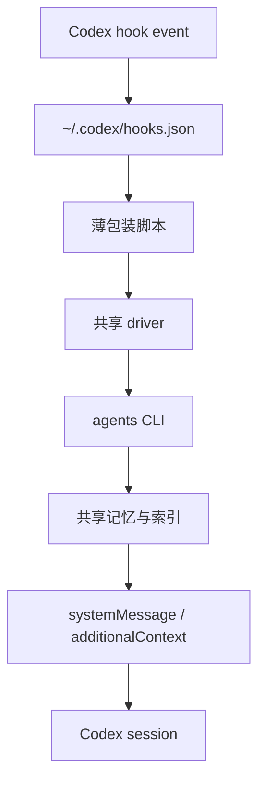

# Codex Hooks 记忆注册设计

## 作用

把 Codex hooks 接到 `dynamic_memory` 的读写链路上，让其他 Codex session 在合适的 turn 边界自动提取记忆、回填记忆，并把短期反馈和长期索引分别落到对应流程。

这是一层 glue 设计，不改变 `agent_identity`、`short-term-feedback`、`memory-distillation`、`long-term-memory-index` 的语义边界。

## 设计目标

- 让 hooks 成为跨 session 的自动触发器
- 让记忆读写继续复用现有 `agents` CLI
- 让短期反馈和长期索引走不同的触发路径
- 避免把完整 transcript 塞进上下文或记忆文件
- 让注册方式可在本机其他 Codex session 中复用

## 非目标

- 不在 hooks 层直接定义 `dynamic_memory` 对象内部结构
- 不把 hooks 当作长期记忆本体
- 不让 hooks 直接写入任意文件格式
- 不在这一步解决远程共享后端或 MCP 化

## 约束

来自当前 Codex hooks 文档的约束：

- `codex_hooks = true` 必须开启
- hooks 可以放在 `~/.codex/hooks.json` 或 `<repo>/.codex/hooks.json`
- 多个匹配 hooks 会同时运行，不能假设“后面的 hook 会覆盖前面的 hook”
- `SessionStart`, `UserPromptSubmit`, `Stop`, `PreToolUse`, `PostToolUse` 是当前可用触发点
- `UserPromptSubmit`、`Stop`、`PreToolUse`、`PostToolUse` 都是 turn scope
- `SessionStart` 支持 `startup|resume` 匹配
- `SessionStart`, `UserPromptSubmit`, `Stop` 可以输出 `systemMessage`
- `SessionStart` 还可以输出 `additionalContext`
- `PreToolUse` 和 `PostToolUse` 当前只针对 `Bash`

结论：

- 记忆主流程应挂在 `SessionStart`、`UserPromptSubmit`、`Stop`
- `PreToolUse`、`PostToolUse` 只做 Bash 级证据护栏和回填，不承担主流程

## 推荐架构

核心原则：

- `hooks.json` 只负责注册和路由
- 薄包装脚本只负责解析事件和整理输入输出
- 共享 driver 负责通用逻辑、去重、限流、状态回填
- `agents` CLI 负责真实记忆读写

## 注册模型

### 机器级注册

主注册点放在 `~/.codex/hooks.json`，作为这台机器上所有 Codex session 的统一入口。

原因：

- 其他仓库里的 session 也能触发同一套 hooks
- 避免每个仓库重复复制一份逻辑
- 统一控制重复写入、限流和故障策略

### 仓库级模板

仓库内保留一份模板配置，作为安装来源和版本控制对象。

建议路径：

- `docs/portable-agent-contract/dynamic-memory/codex-hooks-memory-registration.md`
- `.codex/hooks.json` 模板
- `.codex/hooks/*.py` 或等价脚本目录模板

### 安装原则

- 只保留一个 active registry
- 不允许 repo-local hooks 和 user-global hooks 以互相独立、重复语义的方式同时生效
- 如果需要双层存在，repo-local 只能作为模板来源，不能再单独注册一套不同逻辑

## Identity binding

hooks 只决定“何时触发记忆动作”，不负责“这个 session 属于哪个 agent_identity”。

active `agent_id` 必须由会话 bootstrap 提前绑定，然后由 hooks 读取。

建议绑定来源优先级：

1. 显式环境变量
2. repo-local session binding 文件
3. bootstrap 注入的默认值

如果没有绑定到有效 `agent_id`，hooks 必须 fail-open 并只记录 warning。

## Hook matrix

### `SessionStart`

用途：

- 冷启动或恢复时预热长期记忆
- 注入当前 agent 的最小行为边界
- 恢复 session 级状态文件

脚本：

- `session_start.py`

职责：

- 读取 active `agent_id`
- 读取 session state
- 调用 `agents verify --agent-id <id>` 做长期记忆提取
- 生成短的 `additionalContext`
- 写回 session state 的 `last_session_start` / `last_retrieval`

输出：

- `additionalContext` 优先
- 必要时 `systemMessage`

### `UserPromptSubmit`

用途：

- 每轮输入前做记忆提取
- 识别任务切换、错误恢复、计划冻结、输出前检查等触发条件
- 给当前 turn 注入最小记忆提示

脚本：

- `user_prompt_submit.py`

职责：

- 读取 prompt 和 session state
- 判断是否触发 `agents verify`
- 从长期记忆索引生成短提示
- 更新短期反馈队列

输出：

- `additionalContext` 优先
- 不要输出长证据正文

### `Stop`

用途：

- 结束 turn 时回填短期反馈
- 将本轮稳定结论、分支选择、失败经验写入长期索引候选队列
- 为下一轮准备压缩后的摘要

脚本：

- `stop.py`

职责：

- 扫描 pending feedback queue
- 调用 `agents run --agent-id <id>` 写回长期记忆
- 生成最短的收尾提示
- 清空或迁移已提交队列

输出：

- 以 `continue: true` 的纯 side effect 为主
- 真实 Codex session smoke 里，`Stop` 若回传额外 `hookSpecificOutput` 会失败
- 因此当前实现不依赖 `Stop` 返回额外上下文，只保留记忆 flush

### `PreToolUse`

用途：

- 只做 Bash 级的证据边界与护栏
- 采集即将执行的命令作为短期反馈的一部分

脚本：

- `pre_tool_use.py`

职责：

- 记录 `tool_input.command`
- 做最小风险判断
- 必要时阻断明显危险的 Bash 命令

输出：

- `systemMessage`
- 只有高风险命令才考虑 block

### `PostToolUse`

用途：

- 只做 Bash 结果回填与证据挂接
- 把工具输出归入短期反馈对象

脚本：

- `post_tool_use.py`

职责：

- 记录 `tool_response`
- 提取 `evidence_refs`
- 更新 short-term feedback sidecar
- 生成是否需要长期晋升的候选标记

输出：

- `systemMessage` 或 `additionalContext`
- 默认不阻断主流程

## 脚本分层

建议不要让每个 hook 脚本直接堆业务逻辑。更稳妥的结构是：

1. `memory-hook-driver.py`
   - 统一解析 Codex hook stdin
   - 统一读写 session state
   - 统一调用 `agents` CLI
   - 统一处理超时、去重和日志
2. `session_start.py`
   - 事件适配器
3. `user_prompt_submit.py`
   - 事件适配器
4. `stop.py`
   - 事件适配器
5. `pre_tool_use.py`
   - 事件适配器
6. `post_tool_use.py`
   - 事件适配器

这样做的目的不是抽象洁癖，而是把重复写入、状态竞争和行为漂移集中在一个点处理。

## 状态模型

hooks 侧需要一个独立的 session state，不要和长期记忆文件混在一起。

建议最小字段：

- `session_id`
- `agent_id`
- `last_inject_turn`
- `last_retrieval_turn`
- `pending_feedback_ids`
- `pending_long_term_candidates`
- `cooldown_turns`
- `last_flush_at`

状态文件只保存控制信息，不保存完整 transcript。

## 数据流

### 启动

1. Codex 触发 `SessionStart`
2. `session_start.py` 读取 active `agent_id`
3. `agents verify` 拉取最小长期记忆
4. 脚本输出 `additionalContext`
5. Codex 会话进入带约束状态

### 输入前

1. Codex 触发 `UserPromptSubmit`
2. `user_prompt_submit.py` 检查 prompt 是否满足检索条件
3. 必要时再次调用 `agents verify`
4. 输出短提示，避免上下文漂移

### 工具调用前后

1. `PreToolUse` 记录即将执行的 Bash 命令
2. `PostToolUse` 记录 Bash 结果
3. 证据被写入短期反馈 sidecar
4. 满足晋升条件时，生成长期候选

### 停止

1. Codex 触发 `Stop`
2. `stop.py` flush pending queue
3. `agents run` 写回长期记忆
4. 清空已提交状态

## 失败策略

### 必须 fail-open 的情况

- 绑定不到有效 `agent_id`
- `agents` CLI 不可用
- session state 文件损坏但可恢复
- 长期记忆检索超时

这类故障只记录 warning，不阻断 Codex 主任务。

### 可以 fail-closed 的情况

- `PreToolUse` 识别到明显危险的 Bash 命令

原因：

- 这是护栏，不是记忆系统本体
- 其他 hook 失败不应把会话卡死

### 去重策略

因为当前 Codex 可能同时运行多个匹配 hook，所以必须有幂等控制：

- 以 `session_id + turn_id + event` 作为去重键
- 同一事件重复到达时直接短路
- 写文件使用原子重命名
- 写回长期记忆前先写 pending queue，再 flush

## 与现有文档的对接

### `short-term-feedback.md`

该文档负责：

- 反馈对象的收集
- `feedback_object` 的最小字段
- 短周期聚合与状态判断

hooks 对接点：

- `UserPromptSubmit`
- `PostToolUse`
- `Stop`

### `long-term-memory-index.md`

该文档负责：

- 长期检索锚点
- `Behavior Delta` 提取条件
- 注入顺序与门控

hooks 对接点：

- `SessionStart`
- `UserPromptSubmit`
- `Stop`

### `memory-distillation.md`

该文档负责：

- `Episode -> Learning -> Behavior Delta` 的晋升过程

hooks 对接点：

- `PostToolUse` 产生证据
- `Stop` 提交候选
- 后台蒸馏再处理候选

## 测试建议

### 单测

- hook 事件到脚本的路由映射
- 去重键生成
- state 读写与原子更新
- `agents` 命令拼装

### 集成测试

- `SessionStart` 能输出最小 `additionalContext`
- `UserPromptSubmit` 在命中条件时触发 `agents verify`
- `Stop` 能 flush pending queue
- `PreToolUse` 只对 Bash 生效
- `PostToolUse` 能回填证据引用

### 端到端测试

- 在一个外部仓库启动 Codex
- 触发 session start / prompt submit / stop
- 验证记忆写入仍落到共享 `agents` 根
- 验证提取结果能回注到会话上下文

## rollout 顺序

1. 先落 `SessionStart`、`UserPromptSubmit`、`Stop`
2. 再补 `PostToolUse`
3. 最后再决定是否要把 `PreToolUse` 的阻断策略扩展得更严

## 开放问题

- active `agent_id` 最终由哪一层注入最稳妥
- `Stop` 是否需要在某些场景下返回 continuation 而不是单纯 flush
- `Stop` 在真实 Codex runtime 中的返回约束是否会随版本变化
- 是否需要给记忆 hook 独立的 installation script
- 是否需要把 session state 迁移为更明确的 JSON schema
