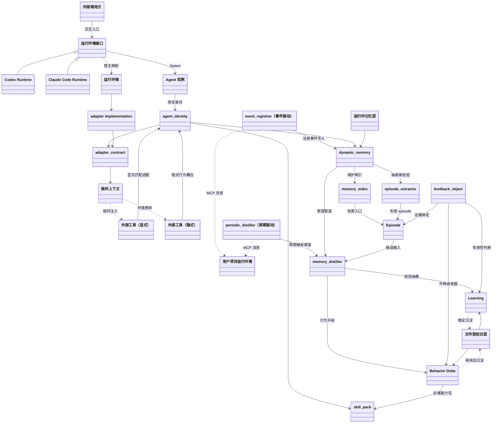

# Portable Agent Contract Relationship Map

下面的 Mermaid 图只表达当前阶段已经稳定下来的对象关系，不表达实现细节。

## 读图说明

- 核心驱动骨架为：`外部调用方 -> 运行环境（Codex/Claude Code）-> Spawn Agent 实例 -> 绑定 agent_identity`
- 外部工具分成 `显式` 与 `隐式` 两类，并通过 `agent_identity` 建立适配关系
- 新增两个流程驱动对象：`event_registrar`（事件驱动）与 `periodic_distiller`（周期驱动）
- `event_registrar` 与 `periodic_distiller` 都通过类 MCP 消息与“用户项目运行环境”通信
- `memory_index` 表达 Agent 在 `dynamic_memory` 上的索引能力
- `episode_extractor` 表达 Agent 对新记忆 `Episode` 的抽取能力
- `memory_distiller` 表达从 `Episode` 到 `Learning / Behavior Delta` 的蒸馏能力
- `feedback_object` 仍是 `dynamic_memory` 的支持对象，不是第五个核心对象
- `运行时记忆层` 与 `文件型知识层` 分离，后者可由 Obsidian 承担
