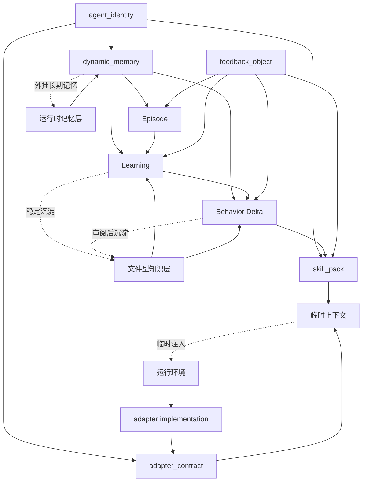

# Portable Agent Contract Relationship Map

下面的 Mermaid 图只表达当前阶段已经稳定下来的对象关系，不表达实现细节。

## 读图说明

- `agent_identity` 约束同一个 Agent 的连续性
- `skill_pack` 是静态能力包
- `dynamic_memory` 是动态经验层
- `adapter_contract` 描述 Agent 对运行环境的能力要求
- `feedback_object` 是 `dynamic_memory` 的支持对象，不是第五个核心对象
- `Episode -> Learning -> Behavior Delta -> skill_pack` 是推荐升级路径
- `运行时记忆层` 与 `文件型知识层` 分离，后者可由 Obsidian 承担
